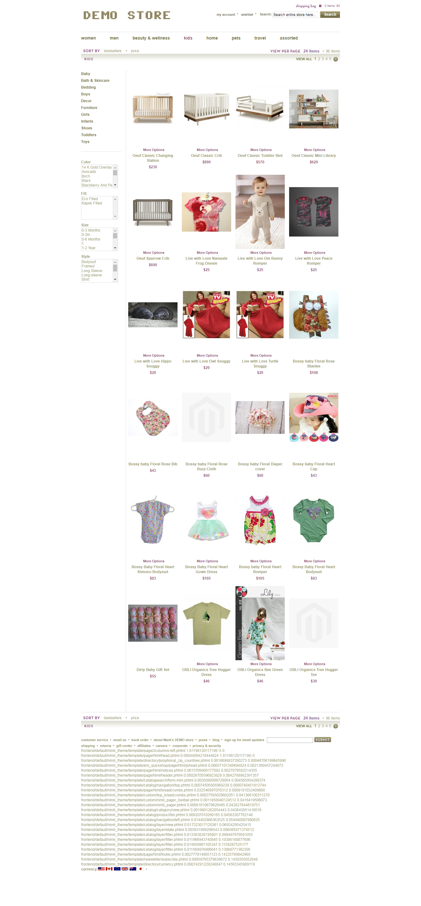

# Magento

Visit my e-commerce store at 

Nimli's site:
www.newpaltzartist.com/saffron

Template Hints by Query String (not by admin):
http://www.newpaltzartist.com/saffron/kids/oeuf-classic-crib.html?hints=1

Profiling various parts of the page to find bottlenecks:
http://www.newpaltzartist.com/saffron/pets.html?profiler=1

Debug SQL queries for debugging (not working here):
http://www.newpaltzartist.com/saffron/pets.html?trace=1

In 2013, I got my Magento Certification and I have 2 years of work experience in Magento. I do not even bother with PHP or Magento anymore, and it was what I did in my past life. It was my very first work experience and it was a time I was knee deep in software engineering day-in and day-out. Looking over some of my past code, I cringe at what I put, but from my past experiences I have prospered. Now that I picked up Python in 2016, it has made me a true Software Developer and PHP isn't really the neatest language for design patterns & abstract object-oriented proramming.

I made this e-commerce store for the company Nimli. Since they changed their site (or went out of business), I saved the store I did for them for my own purposes, and I made the whole front-end AND back-end for them. I made an fully functioning entire e-commerce store in my earliest days as a professional developer.

Anything under "app" is customized code that overridden the default features in the "app/code/core" directory

The overridden custom theme is located in "app\design\frontend\default\nimli_theme" entitled Nimli Theme

| File | Purpose |
| ------ | ------ |
| app\code\community\Yoast | I customed this to show a products page based on various attributes of the product, such as bestsellers |
| app\code\local\Mage\Catalog\Block\Product\List.php | Overrides default Magento core functionality, and this will CHANGE the product list before it displays on a page. When a product list is filtered (by best sellers for example), the sorting (SQL Ordering) happens here |
| app\code\local\Mage\Core\Block\Template.php | This does TWO things. It allows for the tracing of every SQL queries for development & debugging (trace=1 in the query string). Also, it profiles how long every single phtml template shows up in the page to look for bottlenecks and which phtml template has bad code. A picture of this profiler is below |
| app\design\frontend\default\nimli_theme | ALL the Customized fragments of a Magento e-commerce page |
| import_items.php | In order to populate the database in Nimli, various scripts were used to import the various components of an e-commerce store, and this imported 40000 items from a spreadsheet into the database. This conditionally determined if it was a configurable product with many options (ie Red or Blue shirt).

